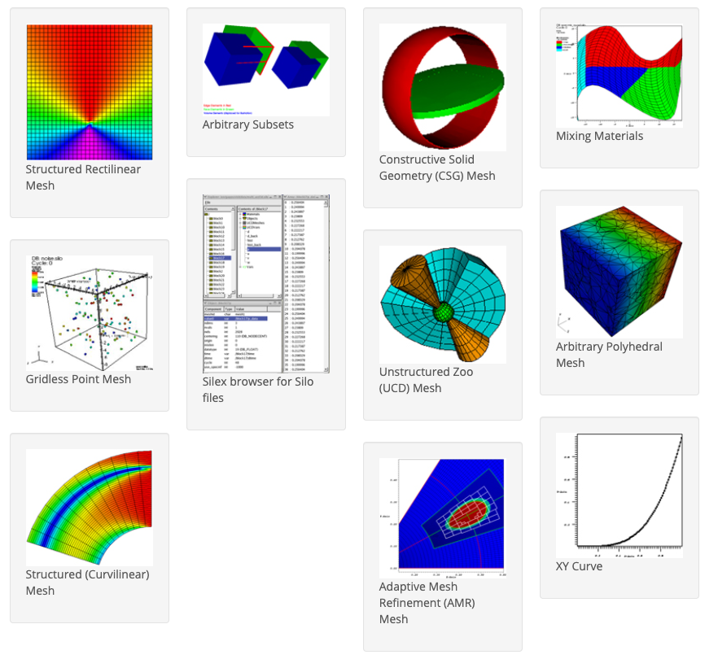

Silo is a [C/Fortran API](https://silo.readthedocs.io/) for reading and writing a wide variety of scientific data to binary files.
Silo files can be easily shared and exchanged between wholly independently developed applications running on disparate computing platforms.

Consequently, Silo facilitates the development of general purpose tools for processing scientific data.
One of the more popular tools to process Silo data is the [VisIt](https://github.com/visit-dav/visit) visualization tool.

Silo supports a variety of mesh types (pictured below) including simple curves, gridless (point), structured, unstructured-zoo and unstructured-arbitrary, block structured AMR, and constructive solid geometry (CSG).

<center></center>

In addition, Silo supports piecewise-constant (e.g., zone-centered) and piecewise-linear (e.g., node-centered) variables (e.g., *fields*) defined on the node, edge, face or volume elements of meshes.

Silo also supports the decomposition of meshes into arbitrary subsets and subset hierarchies including materials with optimal mixing.

Although Silo is a serial library, key features enable it to be applied easily and effectively in scalable, parallel applications using the [Multiple Independent File (MIF)](https://www.hdfgroup.org/2017/03/mif-parallel-io-with-hdf5/) parallel I/O paradigm.


## build


```bash
conda activate temp
conda install hdf5
conda install perl
conda instal zlib

# install qt and add qt bin to path: C:\Qt\6.5.3\msvc2019_64\bin

mkdir build
cd build


# manual set dll files
CMake/SiloFindHDF5.cmake
    message(STATUS "***dll: ${HDF5_DLL}  dest:  ${CMAKE_INSTALL_BINDIR}")

CMake/SiloFindZlib.cmake
    # get_target_property(ZLIB_DLL zlib IMPORTED_LOCATION_RELEASE)
    set(ZLIB_DLL "C:/Users/amcax/Miniconda3/Library/bin/zlib.dll")
    message(STATUS "***dll: ${ZLIB_DLL}  dest:  ${CMAKE_INSTALL_BINDIR}")

# replace xxx with your user
cmake .. -DSILO_ENABLE_PYTHON_MODULE=ON `
-DHDF5_DIR=C:/Users/xxx/miniconda3/envs/temp/Library `
-DZLIB_DIR=C:/Users/xxx/miniconda3/envs/temp/Library `
-DZLIB_INCLUDE_DIR=C:/Users/xxx/Miniconda3/envs/temp/Library/include `
-DZLIB_LIBRARY=C:/Users/xxx/Miniconda3/envs/temp/Library/lib/zlib.lib `
-DSILO_ENABLE_FORTRAN=OFF `
-DSILO_ENABLE_SILEX=OFF `
-DSILO_ENABLE_BROWSER=OFF `
-DSILO_ENABLE_BROWSER=ON `
-DSILO_ENABLE_SILEX=ON `

cmake --build . --config Release
cmake --install .
# install to ../SiloInstall

```

## packge

zip ../SiloInstall to Silo.zip

lib/cmake/Silo/SiloConfig.cmake:
```bash
include (${PACKAGE_PREFIX_DIR}/cmake/SiloTargets.cmake)
=>
include (${PACKAGE_PREFIX_DIR}/lib/cmake/Silo/SiloTargets.cmake)

```

## install

extract Silo.zip to c:/program files/Silo

add to path:  c:/program files/Silo/bin

add to PYTHONPATH:  c:/program files/Silo/bin

## c++ use


```cmake
find_package(Silo REQUIRED)
find_library(SILO_LIBRARY NAMES silo siloh5 PATHS "${SILO_INCLUDE_DIR}/../lib")
target_include_directories(${PROJECT_NAME} PUBLIC 
    ${SILO_INCLUDE_DIR}
)
target_link_libraries(${PROJECT_NAME} PRIVATE 
    ${SILO_LIBRARY} 
)
# make sure Silo/bin before VisIt location
if(MSVC)
    set_target_properties(${PROJECT_NAME} PROPERTIES VS_DEBUGGER_ENVIRONMENT "${SILO_INCLUDE_DIR}/../bin;%PATH%")
endif()

```

## python use

```python
import Silo
import numpy as np

# Create Silo file
db = Silo.Create("test.silo", "Test", Silo.DB_HDF5, Silo.DB_CLOBBER)
```

## document

https://silo.readthedocs.io/intro.html

https://visit-sphinx-github-user-manual.readthedocs.io/en/3.4rc/data_into_visit/SiloFormat.html

https://visit-dav.github.io/visit-website/pdfs/GettingDataIntoVisIt2.0.0.pdf

## demo

https://github.com/AndrewChan2022/gensilo

