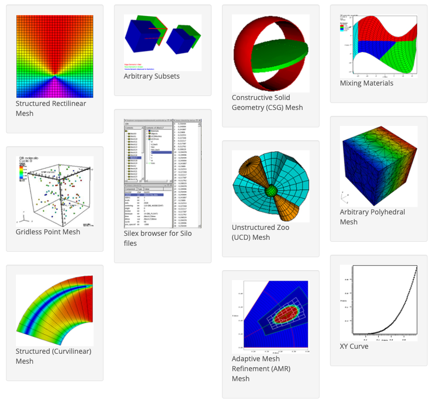

# About Silo...

Silo is a library for reading and writing a wide variety of scientific data to binary, files.
The files Silo produces and the data within them can be easily shared and exchanged between wholly independently developed applications running on disparate computing platforms.
Consequently, Silo facilitates the development of general purpose tools for processing scientific data.
One of the more popular tools that process Silo data files is the [VisIt](https://github.com/visit-dav/visit) visualization tool.



Silo supports gridless (point) meshes, structured meshes, unstructured-zoo and unstructured-arbitrary-polyhedral meshes, block structured AMR meshes, constructive solid geometry (CSG) meshes, piecewise-constant (e.g., zone-centered) and piecewise-linear (e.g. node-centered) variables defined on the node, edge, face or volume elements of meshes as well as the decomposition of meshes into arbitrary subset hierarchies including materials and mixing materials.
In addition, Silo supports a wide variety of other useful objects and metadata to address various scientific computing application needs.
Although the Silo library is a serial library, key features enable it to be applied effectively in scalable, parallel applications using the [Multiple Independent File (MIF)](https://www.hdfgroup.org/2017/03/mif-parallel-io-with-hdf5/) parallel I/O paradigm.

Architecturally, the library is divided into two main pieces; an upper-level application programming interface (API) and a lower-level I/O implementation called a *driver*.
Silo supports multiple I/O drivers.
The two most common are the HDF5 (Hierarchical Data Format 5) and PDB (Portable DataBase) drivers.

## Major sections of the user's manual

```{toctree}
:maxdepth: 1
./intro.md
./globals.md
./files.md
./objects.md
./parallel.md
./subsets.md
./alloc.md
./utility.md
./optlists.md
./generic.md
./json.md
./conventions.md
./fortran.md
./python.md
./deprecated.md
./header.md
```

## Manuals for previous versions

* [Most recently released manual (4.10)](https://wci.llnl.gov/sites/wci/files/2020-08/LLNL-SM-654357.pdf)

## Contacts

For inquiries, users are encouraged to use Silo's [GitHub Discussions space](https://github.com/LLNL/Silo/discussions).
GitHub accounts are free.
