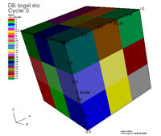
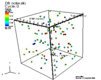
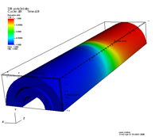
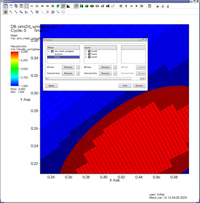

Each row in the table below is an example of the use of Silo to represent a different kind of scientific data.
Each example shows a picture of the data (visualized with [VisIt](https://visit.llnl.gov), describes some of the key concepts the example demonstrates, lists a set of key Silo functions the example uses and provides links to both C or C++ source code used to generate the data as well as the resulting Silo data file.
All of the examples here use some common Silo functions such as [DBCreate] and [DBClose] or functions to manage [option lists](https://silo.readthedocs.io/en/latest/optlists.html) such as [DBMakeOptlist] or [DBAddOption].
So, those calls are not explicitly mentioned.

### Constructive Solid Geometry

[VisIt](https://visit.llnl.gov) Image | Related assets
:---: | :---
 | [`csg.silo` data file](csg.silo) [`csg_mesh.C` source code](csg_mesh.C)

* **Key concepts**: Representation of Constructive Solid Geometry (CSG) meshes, variables and materials defined on CSG meshes and multiple meshes in a single file, error controls.
* **Silo functions**: [DBPutCSGZonelist], [DBPutCsgmesh], [DBPutCsgvar], [DBPutMaterial], [DBShowErrors].

### Materials and Mixing Materials

[VisIt](https://visit.llnl.gov) Image | Related assets
:---: | :---
 | [`specmix_quad.silo` quadmesh file](specmix_quad.silo) [`specmix_ucd.silo` ucdmesh file](specmix_ucd.silo) [`specmix_quad.C` source code](specmix_quad.C)

* **Key concepts**: Representation of the same mesh data on both quadrilateral (Quad) and unstructured (UCD) meshes, quadrilateral mesh with deformed (nonlinear) coordinates, representation of materials and mixing materials and material species.
* **Silo calls**: [DBPutMaterial], [DBPutMatspecies], [DBPutQuadmesh], [DBPutZonelist].

### Parallel Decomposed Meshes

[VisIt](https://visit.llnl.gov) Image | Related assets
:---: | :---
 | [`bigsil.silo` data file](bigsil.silo) [`bigsil.C` source code](bigsil.C)

* **Key concepts**: Representation of parallel decomposition of data using multi-block objects, grouping of blocks into 'groups' using '_visit_domain_groups' convention and other conventions, use of directories.
* **Silo calls**: [DBMkDir], [DBPutMaterial], [DBPutMultimat], [DBPutMultimesh], [DBPutMultivar], [DBPutQuadmesh], [DBSetDir], [DBWrite].

### Point (Gridless) Meshes

[VisIt](https://visit.llnl.gov) Image | Related assets
:---: | :---
 | [`noise.silo` data file](noise.silo) [`noise.C` source code](noise.C)

* **Key concepts**: Point (gridless) meshes and variables, use of directories, quadrilateral meshes and variables.
* **Silo calls**: [DBMkDir], [DBPutMaterial], [DBPutPointmesh], [DBPutPointvar], [DBPutQuadmesh], [DBPutQuadvar], [DBWrite].

### Unstructured Zoo and Arbitrary Polyhedral Meshes

[VisIt](https://visit.llnl.gov) Image | Related assets
:---: | :---
 | [`poly3d.silo` data file](poly3d.silo) [`testall.C` source code](testall.C)

* **Key concepts**: Unstructured cell data (UCD) meshes with ordinary 'zoo type' elements and arbitrary polyhedral elements.
* **Silo calls*: [DBFreeFacelist], [DBPutFacelist], [DBPutMaterial], [DBPutMatspecies], [DBPutQuadmesh], [DBPutUcdmesh], [DBPutUcdvar], [DBPutZonelist], [DBShowErrors], [DBWrite], [DBCalcExternalFacelist].

### Block-Structured Adaptive Mesh Refinement Meshes

[VisIt](https://visit.llnl.gov) Image | Related assets
:---: | :---
 | [`amr2d_mesh_config.xml` config file](amr2d_mesh_config.xml) [`amr2d_wmrgtree.silo` data file](amr2d_wmrgtree.silo) [`amr3d_mesh_config.xml` config file](amr3d_mesh_config.xml) [`amr3d_wmrgtree.silo` data file](amr3d_wmrgtree.silo) [`add_amr_mrgtree.C` source file](add_amr_mrgtree.C)

* **Key concepts**: Adaptive Mesh Refinement (AMR) meshes, Quadmeshes, Mesh Region Grouping trees (Mrgtrees) and variables (Mrgvars), Grouping Element Maps (Groupelmaps).
  Without Mrgtrees, a multiblock mesh of Quadmeshes representing the different patches of an AMR hierarchy is not properly organized into an AMR hierarchy.
  The Silo file examples provided here contain two multi-block representations of the meshes, one without an Mrgtree and one with, so you can understand the difference and what the Mrgtree information is doing.
* **Silo calls**: DBMkMrgtree, DBAddRegion, DBAddRegionArray, DBPutMrgtree DBPutGroupelmap, DBPutMrgvar.

[DBMkMrgtree]: https://silo.readthedocs.io/en/latest/subsets.html#dbmakemrgtree
[DBAddRegion]: https://silo.readthedocs.io/en/latest/subsets.html#dbaddregion
[DBAddRegionArray]: https://silo.readthedocs.io/en/latest/subsets.html#dbaddregionarray
[DBPutMrgtree]: https://silo.readthedocs.io/en/latest/subsets.html#dbputmrgtree
[DBPutGroupelmap]: https://silo.readthedocs.io/en/latest/subsets.html#dbputgrupelmap
[DBPutMrgvar]: https://silo.readthedocs.io/en/latest/subsets.html#dbputmrgvar

[DBCreate]: https://silo.readthedocs.io/en/latest/files.html#dbcreate
[DBClose]: https://silo.readthedocs.io/en/latest/files.html#dbclose
[DBMakeOptlist]: https://silo.readthedocs.io/en/latest/optlists.html#dbmakeoptlist
[DBAddOption]: https://silo.readthedocs.io/en/latest/optlists.html#dbaddoption
[DBFreeOptlist]: https://silo.readthedocs.io/en/latest/optlists.html#dbfreeoptlist

[DBPutMultimat]: https://silo.readthedocs.io/en/latest/parallel.html#dbputmultimat
[DBPutMultimesh]: https://silo.readthedocs.io/en/latest/parallel.html#dbputmultimesh
[DBPutMultivar]: https://silo.readthedocs.io/en/latest/parallel.html#dbputmultivar

[DBMkDir]: https://silo.readthedocs.io/en/latest/files.html#dbmkdir
[DBMkDir]: https://silo.readthedocs.io/en/latest/files.html#dbsetdir
[DBPutCSGZonelist]: https://silo.readthedocs.io/en/latest/objects.html#dbputcsgzonelist
[DBPutZonelist]: https://silo.readthedocs.io/en/latest/objects.html#dbputzonelist
[DBPutFacelist]: https://silo.readthedocs.io/en/latest/objects.html#dbputfacelist
[DBPutCsgmesh]: https://silo.readthedocs.io/en/latest/objects.html#dbputcsgmesh
[DBPutQuadmesh]: https://silo.readthedocs.io/en/latest/objects.html#dbputquadmesh
[DBPutQuadvar]: https://silo.readthedocs.io/en/latest/objects.html#dbputquadvar
[DBPutUcdmesh]: https://silo.readthedocs.io/en/latest/objects.html#dbputucdmesh
[DBPutUcdvar]: https://silo.readthedocs.io/en/latest/objects.html#dbputucdvar
[DBPutPointmesh]: https://silo.readthedocs.io/en/latest/objects.html#dbputpointmesh
[DBPutCsgvar]: https://silo.readthedocs.io/en/latest/objects.html#dbputcsgvar
[DBPutMaterial]: https://silo.readthedocs.io/en/latest/objects.html#dbputmaterial
[DBPutMatspecies]: https://silo.readthedocs.io/en/latest/objects.html#dbputmatspecies
[DBShowErrors]: https://silo.readthedocs.io/en/latest/globals.html#dbshowerrors
[DBCalcExternalFacelist]: https://silo.readthedocs.io/en/latest/utility.html#dbcalcexternalfacelist2

[DBWrite]: https://silo.readthedocs.io/en/latest/generic.html#dbwrite
